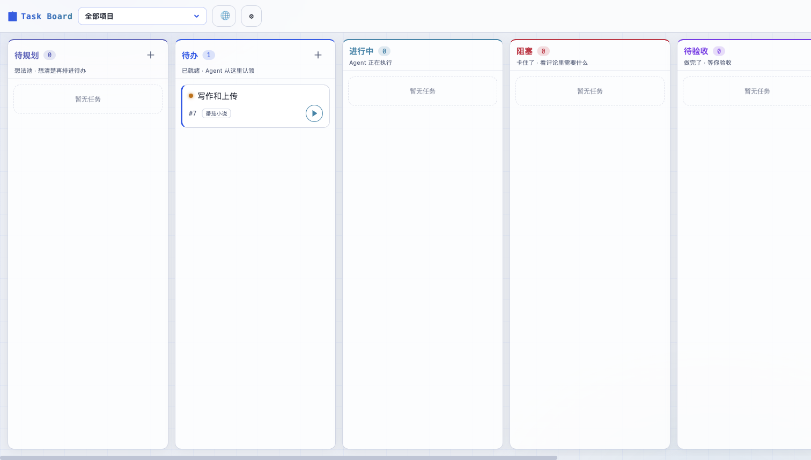
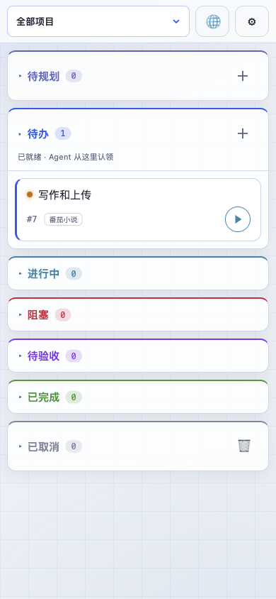
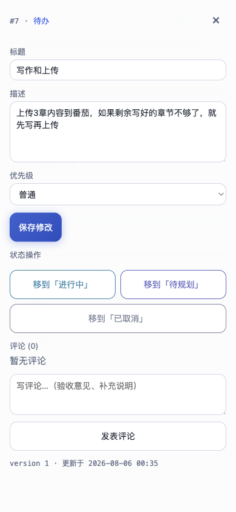
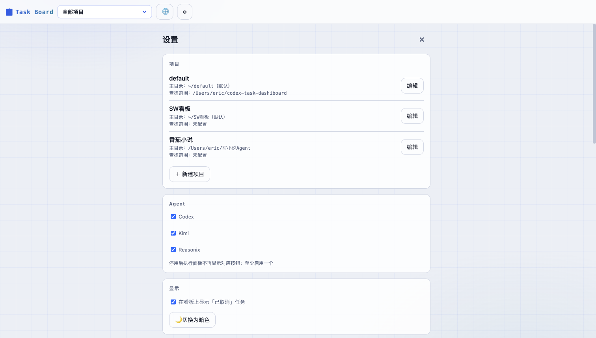
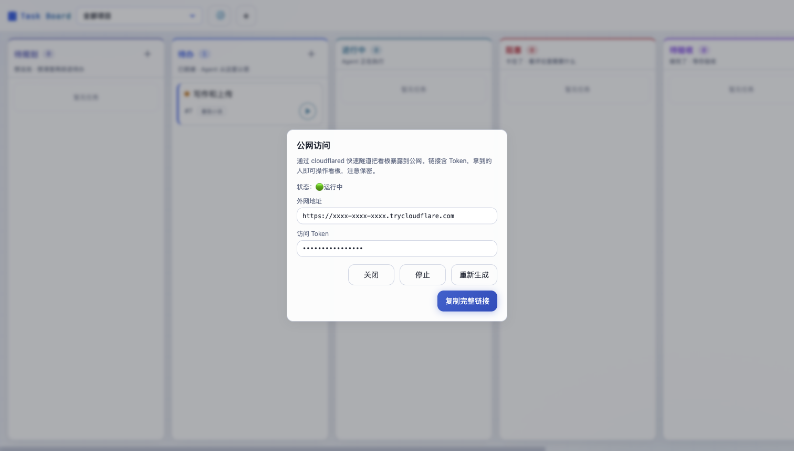
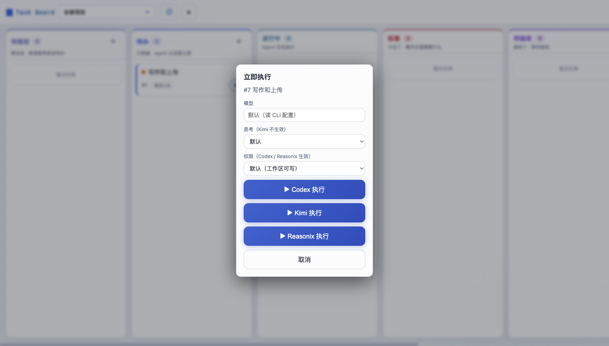

# Taskpin

个人本地 AI 任务看板：把任务丢上看板，Agent 认领执行，你只管验收。

浏览器看板 UI + REST API + SQLite + `taskctl` CLI + Agent Skill 协议。**零 npm 依赖**，只用 Node 内置模块（`node:http` / `node:sqlite` / `node:test`），Node.js ≥ 22.5 即可运行，无构建步骤。

<p>
  
  
  
</p>

```
你（浏览器/手机看板）                       Agent（Codex / Kimi / Reasonix）
      |                                       |
      | 建任务、排进 todo                      | taskctl list --status todo
      v                                       v
   SQLite  ←——————— taskctl claim <id>（原子认领）
      ^                                       |
      |                                       | 实现 + 自验证
      | 验收 → done                            | comment + 置 in_review
      └──────── SSE 实时刷新 ←—————————————————┘
```

## 特性

- **多 Agent 执行**：从看板一键拉起 Codex / Kimi / Reasonix CLI 执行任务，可指定模型、思考强度、权限；不需要的 Agent 可在设置页停用
- **实时输出**：执行中卡片上的 agent 名/用时可点开输出弹框，实时滚动显示思考/输出流（3s 轮询，自动滚底）
- **异常退出告警**：Agent 进程非零退出的任务卡片标红（⚠ 异常退出角标），下次执行或正常结束自动消除
- **额度一览**：顶栏 💰 展开可隐藏的额度区——DeepSeek 钱包余额、Kimi 周额度/5h 窗口/Extra Usage、Codex 计费（OpenAI 标准接口，第三方中转站可能不支持）；全部走元数据接口、不消耗模型 token，60s 缓存
- **问答模式**：执行前的需求澄清——Agent 只讨论不实现，通过评论来回问答，把需求/规则/验收标准写回任务描述；待规划/待办/阻塞可发起
- **验收标准前置**：开发类任务没有「验收标准」时 Agent 不动手，给草案并进阻塞问你；交付时对照标准逐条自验证
- **会话续跑**：打回重做时恢复原 CLI 会话（`codex exec resume` / `kimi -S` / `reasonix run --resume`），Agent 记得上轮细节；跨 Agent 靠评论继承记忆
- **执行中提问**：Agent 遇到需要你决策的事会发 `[提问]` 评论并把任务置「阻塞」，抽屉里直接答复，「提交并继续」自动续跑会话
- **项目记忆与规则**：任务验收进 `done` 时摘要追加到主目录 `TASKBOARD_MEMORY.md`；跨任务规则可沉淀到 `TASKBOARD_RULES.md`，执行和问答都会先读
- **多项目**：每个项目可配多个仓库路径（查找范围）和一个主目录（工作目录）；「全部项目」总览视图
- **手机可用**：移动端纵向手风琴布局 + 按钮操作，不依赖拖拽；内置 cloudflared 隧道管理，一键把看板暴露到公网
- **自定义提示词**：执行（新会话/续跑）和问答三个模板都可在设置页查看、修改、恢复默认
- **亮暗双主题**，SSE 实时刷新（`taskctl` CLI 直写 SQLite 也会经数据库文件监听触发广播），乐观锁防并发冲突，原子认领防重复执行；对话框点外部不关闭，操作按钮带 loading 防重复点击



## 快速开始

```bash
npm start            # 或 node server/index.mjs
# 打开 http://127.0.0.1:47824
```

- 看板列：`待规划 / 待办 / 进行中 / 阻塞 / 待验收 / 已完成`，`已取消` 默认隐藏（设置页可开启显示）。
- 桌面端可直接拖拽卡片改状态；手机端点卡片进详情，用状态按钮操作。
- 删除：**只能删「已取消」的任务**。单个删除在任务详情（抽屉）的「🗑 删除任务」按钮（有确认）；「已取消」列头的 🗑 按钮批量删除当前视图下全部已取消任务。对应 API：`DELETE /api/tasks/:id`、`POST /api/tasks/batch-delete {ids}`（事务，混着未取消任务会整体失败）。
- 状态机：`待规划 → 待办 → 进行中 → 待验收 → 已完成`；「进行中」可进「阻塞」（答复后回「待办」继续），各活动状态可进「已取消」（终态）。进「已完成」必须由用户验收，Agent 无法自判完成；「已完成」允许回退到「待办」「待规划」或取消。
- 数据默认在 `~/.codex-task-dashiboard/taskboard.sqlite`（`TASKBOARD_DB` 可覆盖）。
- **评论可附图**：在评论框直接粘贴截图，或点 📎 从相册/文件选择（最多 6 张、单张 ≤8MB，png/jpg/gif/webp）。图片存数据库同目录的 `attachments/`，评论里显示缩略图（点击看原图）；Agent 执行时会从 `taskctl show` 拿到图片的本地绝对路径，可直接读图。

## 手机访问（内网穿透）

顶栏 🌐 按钮（仅本机访问时显示）→「开始分享」即可：服务端拉起 `cloudflared` 快速隧道，弹框显示外网域名和 Token，「复制完整链接」得到带 `?token=` 的地址发给手机。「重新生成」换新域名，「停止」关隧道。隧道关闭后弹框仍显示上次使用的域名（标注已失效）。前提：主机已安装 `cloudflared`。对应 API：`GET /api/tunnel`、`POST /api/tunnel/start|stop|restart`。



也可以用任意隧道工具手动转发本机端口：

```bash
cloudflared tunnel --url http://127.0.0.1:47824
# 或 frpc 配置 local_port = 47824
```

**暴露公网前务必设置访问 Token**，否则任何拿到链接的人都能操作看板：

```bash
TASKBOARD_TOKEN=你的随机长字符串 npm start
```

本机浏览器用 `localhost` / `127.0.0.1` 打开时**免 Token**（按 HTTP Host 判断，隧道流量的 Host 是公网域名，照常校验）。手机经隧道访问时输入一次 Token 即可（存在 localStorage，或用 `?token=` 链接直接登录）。若想让局域网设备直连（不走隧道），用 `HOST=0.0.0.0 npm start`，仅在可信网络下这样做——同网段主机可伪造 `Host: localhost` 绕过 Token 校验。

## 立即执行（从看板拉起 Agent）

任务卡片右下角有 ▶ 按钮，点击后选择 **Codex**、**Kimi** 或 **Reasonix**（设置页可停用某个 Agent，停用后按钮隐藏且 API 拒绝执行，至少启用一个），并可指定模型、思考强度（Kimi 不生效）和权限（Kimi 不生效），服务端会在本机拉起对应 CLI 执行该任务：



- Codex：`codex exec -s <权限> -C <项目主目录> --add-dir <看板数据库目录>`（沙箱内可写工作区和看板库；权限可选只读/工作区可写/完全开放，思考强度 `-c model_reasoning_effort=low|medium|high`）
- Kimi：`kimi -p <prompt>`（此版本 kimi 的 `-p` 不能与 `--auto`/`-y` 组合，思考/权限选项不生效）
- Reasonix：`reasonix run --dir <项目主目录> --permission-mode <模式> --add-dir <看板数据库目录> --output-format json`（权限选项映射：只读→plan、工作区可写→auto、完全开放→bypassPermissions，也可直接传 reasonix 的模式名；模型是 provider 名如 `deepseek-flash`/`deepseek-pro`）
- 工作目录 = 项目主目录；项目未配置主目录时自动创建 `~/<项目名>` 并使用
- **执行即进「进行中」**：点击执行后任务自动流转到 `进行中`（待规划先经待办，阻塞/待验收直接流转；认领由看板自动完成，Agent 无需再 claim），卡片位置实时反映后台执行状态
- 执行 prompt 内置了 manage-taskboard 协议（实现 → 自验证 → 交付待验收），且会先读主目录的 `TASKBOARD_MEMORY.md`（已验收任务的项目记忆）
- **会话续跑**：执行结束自动把 CLI 会话 id 记入任务 `thread_id`；再次执行时若上次是同 agent 则恢复原会话（`codex exec resume <id>` / `kimi -S <id>` / `reasonix run --resume <会话文件>`），Agent 记得上轮改过的细节。跨 agent 执行无法续跑，自动开新会话、靠评论继承任务记忆
- **执行中提问**：Agent 需要用户决策时会发 `[提问]` 评论并把任务置为「阻塞」（抽屉里该评论带"等你答复"徽章）；抽屉里出现内联答复框，「提交并继续」= 发评论 + 自动同 agent 续跑（阻塞续跑执行，待规划/待办续跑问答），也可以手动评论后重新执行
- **问答模式**：执行面板切到「问答」（仅待规划/待办/阻塞可发起，API `mode: 'qa'`），Agent 只讨论不实现、不自动流转状态；讨论结论由它结构化写回任务描述（需求/目标/规则约束/验收标准），跨任务规则可追加到主目录 `TASKBOARD_RULES.md`
- **验收标准前置**：开发类任务描述中没有「验收标准」时，Agent 不动手实现——给 2-4 条标准草案发 `[提问]` 并置「阻塞」，问答补齐后放回待办再执行；交付时对照标准逐条验证。点执行时若描述缺标准，面板会提示建议先问答（不拦截）
- **提示词模板可自定义**：设置页 →「执行提示词模板」可查看/修改新会话、续跑、问答三个模板（占位符 `{{task_id}}` `{{tctl}}` `{{project_name}}` `{{scope}}` `{{claim_step}}`），留空或点「恢复默认」回到内置版本
- **自动认领提示词**：设置页 →「自动认领提示词」一键复制，贴给终端里常驻的 Agent 会话，它会循环认领「待办」任务逐个执行（每 5 分钟空转检查一次）
- 同一任务同时只允许一个执行（重复点击返回 409）；执行中的卡片显示 ■ 按钮可停止（SIGTERM）。**停止执行、或进程退出时任务仍停在「进行中」的，都会自动放回「待规划」**并写评论说明（Agent 已自行交付/提问流转的不打扰）
- 进程结束时自动在任务评论里追加一条 `[runner]` 记录（退出码、用时、输出尾部）；**非零退出的任务卡片会标红**（`tasks.last_run` 字段，新执行开始或正常结束时清除）
- **上下文大小**：任务详情属性栏显示「上下文」一行——优先用最近一次执行从 agent 输出解析到的会话用量（`tasks.usage`：codex 的 `tokens used`、reasonix 结果行的 `usage`；kimi 无用量输出），没有则用任务描述+全部评论粗估；两种都标注统计来源
- 执行中点击卡片上的 agent 名/用时：弹框实时滚动显示 Agent 输出（3s 轮询 `run/output` 接口，保留 64KB 尾部缓冲）；任务详情（左侧双栏抽屉）里也可直接发起执行/停止
- 前提：主机已安装并登录 `codex` / `kimi` / `reasonix` CLI。运行状态在内存中，重启看板服务即丢失跟踪

对应 API：`POST /api/tasks/:id/execute {agent, model?, effort?, permission?}`、`GET /api/runs`、`GET /api/tasks/:id/run/output`、`DELETE /api/tasks/:id/run`。

## taskctl CLI

CLI 直接读写同一个 SQLite，看板服务不在线也能用。默认输出 JSON，`--pretty` 人性化输出。

```bash
alias taskctl="node $PWD/cli/taskctl.mjs"   # 或加到你的 shell 配置

taskctl projects                            # 项目列表
taskctl project-create --name demo --path ~/code/demo,~/code/lib   # 路径可多个，逗号分隔
taskctl project-update 1 --path ~/code/demo # 重置路径列表（--path "" 清空）
taskctl project-delete 1                    # 删除项目（仅限没有未取消任务）
taskctl create --title "修 bug" --desc "..." --priority high
taskctl list --status todo
taskctl show 3                              # 详情 + 全部评论
taskctl claim 3                             # 原子认领 todo -> in_progress
taskctl comment 3 --body "完成，测试通过" --author agent
taskctl comment 3 --body "看截图" --image a.png --image b.jpg   # --image 可多次
taskctl update 3 --status in_review --if-version 2
taskctl done 3 --if-version 3               # 仅用户：验收
taskctl serve                               # 等同于 npm start
```

错误以 JSON 打到 stderr 且退出码非零：`CLAIM_CONFLICT`（认领冲突）、`VERSION_CONFLICT`（版本过期）、`INVALID_TRANSITION`（非法状态跳转）。

项目可配置多个本地仓库路径（看板 ⚙ 设置页 → 项目 → 编辑，或 `project-update`，逗号分隔），这些路径合起来是 Agent 的默认查找范围（提示性质，不作沙箱限制）。每个项目还有一个**主目录**（可配置，默认自动创建 `~/<项目名>`），是 Agent 执行时的工作目录。任务验收进 `done` 时，看板会把任务摘要（标题、需求、Agent 结果、验收意见）按固定结构追加到主目录的 `TASKBOARD_MEMORY.md`，同一项目的记忆都汇总在这一个文件里。看板顶栏的项目下拉支持「全部项目」视图（默认），任务卡片以徽章标注所属项目；新建任务时可在弹窗中选择项目。

## 接入 Agent（Codex / Kimi / Reasonix）

把 Skill 安装到 Agent 的 skill 目录：

```bash
# Kimi Code / Claude Code 风格
cp -r skills/manage-taskboard ~/.agents/skills/

# Codex：按你的 skills 目录放置，例如
cp -r skills/manage-taskboard ~/.codex/skills/
```

然后在对话里说"去看板领一个任务做"，Agent 会按协议执行：读任务与评论 → 原子认领 → 实现并自验证 → 评论结果 → 置 `待验收`。**只有你能把任务拖进 `已完成`**。

## 环境变量

| 变量 | 默认 | 说明 |
| --- | --- | --- |
| `PORT` | `47824` | 监听端口 |
| `HOST` | `127.0.0.1` | 监听地址（`0.0.0.0` 可局域网直连，注意 Token 绕过风险） |
| `TASKBOARD_DB` | `~/.codex-task-dashiboard/taskboard.sqlite` | SQLite 数据文件 |
| `TASKBOARD_TOKEN` | （空） | 访问 Token；暴露公网前必须设置，本机 Host 访问免校验 |
| `REASONIX_HOME` | `~/.reasonix` | Reasonix 会话文件定位（续跑用） |

## API 一览

统一 JSON；错误格式 `{error:{code,message}}`（409 冲突附带 `current` 任务快照）。

| 方法 | 路径 | 说明 |
| --- | --- | --- |
| GET | `/api/projects` / POST 同路径 | 项目列表 / 新建项目 |
| PATCH/DELETE | `/api/projects/:id` | 编辑项目（名称、路径列表、主目录）/ 删除项目（仅限没有未取消任务，任务与评论级联删除） |
| GET | `/api/tasks?project_id=&status=&include_canceled=1` | 任务列表 |
| POST | `/api/tasks` | 新建任务（只能落 `backlog`/`todo`） |
| GET/PATCH/DELETE | `/api/tasks/:id` | 详情（含评论）/ 更新（乐观锁 `version`）/ 删除（仅已取消） |
| POST | `/api/tasks/batch-delete {ids}` | 批量删除（事务） |
| POST | `/api/tasks/:id/claim` | 原子认领 |
| POST | `/api/tasks/:id/comments` | 评论（`author: user\|agent`，`images` 可附图片 dataURL 数组） |
| GET | `/api/attachments/:taskId/:file` | 评论图片附件 |
| POST | `/api/tasks/:id/execute` | 拉起 Agent（`agent, mode?: execute\|qa, model?, effort?, permission?`；qa 仅待规划/待办/阻塞） |
| GET | `/api/runs` · DELETE `/api/tasks/:id/run` | 运行列表 / 停止执行 |
| GET | `/api/tasks/:id/run/output` | 运行中任务的实时输出（未在运行返回 404） |
| GET | `/api/quota?refresh=1` | 三家 Agent 额度/余额（60s 缓存，`refresh=1` 强制刷新） |
| GET/PATCH | `/api/settings` | 全局设置（启用的 Agent、prompt 模板覆盖） |
| GET | `/api/prompt-defaults` | 内置 prompt 模板 + 自动认领提示词 |
| GET | `/api/tunnel` · POST `/api/tunnel/start\|stop\|restart` | 公网隧道状态与管理 |
| GET | `/api/events` | SSE（只有 `{"type":"change"}` 一种事件） |

## 开发

```bash
npm test             # node --test test/
```

结构：`server/db.mjs`（schema + 状态机 + 乐观锁，server 与 CLI 共用）、`server/api.mjs` + `server/index.mjs`（REST + 静态 + SSE + Token 认证 + 数据库文件监听广播）、`server/runner.mjs`（Agent 执行器）、`server/quota.mjs`（三家额度查询）、`server/tunnel.mjs`（cloudflared 隧道管理）、`cli/taskctl.mjs`、`public/`（无构建前端）、`skills/manage-taskboard/`（Agent 协议）。更多约定见 [AGENTS.md](AGENTS.md)。

## 灵感来源

- **[dashi-taskboard](https://github.com/chuspeeism/dashi-taskboard)** —— 看板界面和「用任务状态驱动 Agent」的工作方式，最初的灵感就来自它。借鉴点：taskctl 稳定写入接口、乐观锁版本控制、Codex thread 归属、`in_review` 必须用户验收的状态协议、本地能力与云端数据分离。状态机 `backlog → todo → in_progress → in_review → done`（分支 `blocked` / `canceled`）完整沿用。
- **[openai/symphony](https://github.com/openai/symphony)** —— OpenAI 官方的 Codex 编排器（Elixir，Apache 2.0）。借鉴点：规范优先，以及「Agent 需要用户输入时进 blocked，而不是循环重试」——本项目的 `[提问]` 评论 + 阻塞交互即源于这条思路。

本项目是参考两者思想的**零依赖自研实现**（dashi-taskboard 为 React 19 + TS + Vite 构建、未附 License；本项目为无构建 vanilla 前端 + Node 内置模块）。开发前的详细对比调研见 [RESEARCH.md](RESEARCH.md)。
